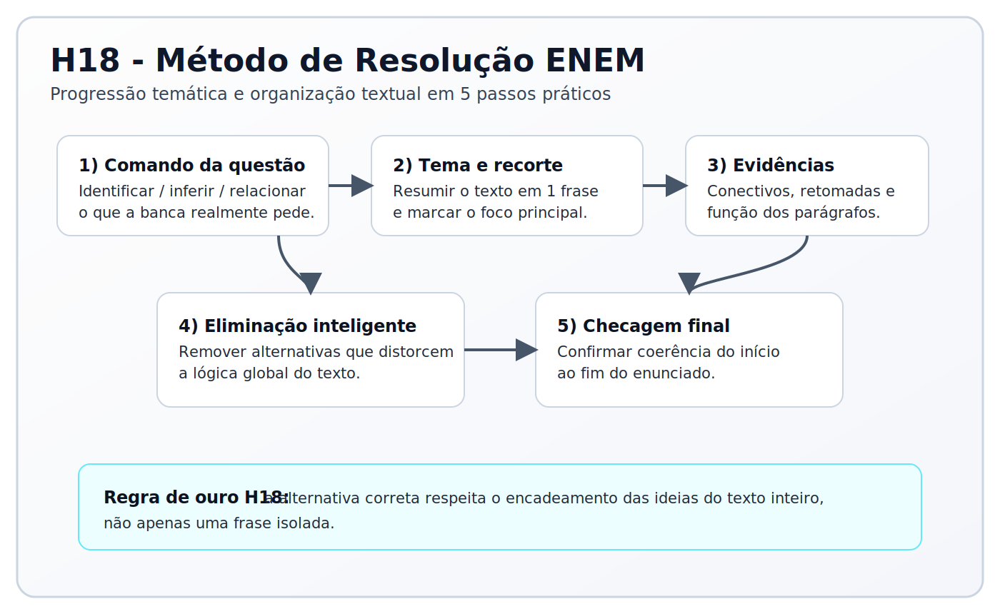

# estudo_enem

Organização de estudo para o ENEM baseada na Matriz de Referência do INEP, com fluxo de uso no Codex.

## Objetivo

Este repositório foi estruturado para você estudar com:
- fonte oficial da matriz;
- planejamento semanal;
- sessões de estudo guiadas por habilidade;
- registro de progresso.

## Estrutura do projeto

- `sources/inep_matriz_referencia.pdf`: PDF base oficial.
- `edital.pdf`: edital oficial do ENEM 2025 (regras e estrutura da aplicação).
- `matriz/matriz_referencia_enem.md`: matriz completa em Markdown.
- `matriz/eixos_cognitivos.md`: eixos cognitivos resumidos.
- `matriz/habilidades_por_area/`: habilidades por área.
- `plano/plano_semanal.md`: planejamento da semana.
- `plano/tracker.md`: histórico de progresso e erros.
- `templates/aula_habilidade_enem.md`: template definitivo de aula por habilidade.
- `notes/`: notas de pesquisa (vídeos, artigos e referências).
- `aulas/`: aulas geradas por área e habilidade.
- `questoes/`: bancos extras de questões por área e habilidade.
- `questoes/banco_reais/`: provas reais extraídas para Markdown (base de calibração).
- `assets/img/`: imagens usadas nas aulas em Markdown/PDF.
- `prompts/agents.global.md`: regras globais de atuação do agente.
- `prompts/contexto_sessao.md`: template para contexto da sessão.
- `prompts/contexto_sessao.example.md`: exemplo preenchido.
- `prompts/contexto_planejador.example.json`: exemplo de contexto para o motor offline.
- `plano/desempenho_habilidades.example.csv`: exemplo de feedback por habilidade.
- `plano/README_planejador_offline.md`: guia do planejador sem IA.
- `plano/roadmap_geral.md`: planejamento macro do projeto e do app open source.
- `app_flutter/`: cliente Flutter offline (desktop + Android) e guia de setup.
- `planner/`: módulo Python de priorização e cronograma determinístico.
- `CHANGELOG.md`: histórico de mudanças do projeto.

## Quick Start

1. Preencha `prompts/contexto_sessao.md`.
2. Inicie uma sessão no Codex com o comando padrão abaixo.
3. Estude por habilidade e registre no tracker.
4. Feche a semana com revisão e replanejamento.

## Planejador offline (sem IA)

Use quando quiser um ciclo totalmente determinístico com base no seu feedback real de acertos por habilidade.

### 1) Preparar arquivos locais

```bash
cp prompts/contexto_planejador.example.json prompts/contexto_planejador.json
cp plano/desempenho_habilidades.example.csv plano/desempenho_habilidades.csv
```

### 2) Gerar plano automático

```bash
python3 scripts/gerar_plano_offline.py
```

Saídas:
- `plano/plano_semanal_gerado.md`
- `plano/prioridades_habilidades.csv`
- `plano/sugestoes_questoes_por_bloco.md` (se houver mapeamento das questões reais)

### 3) Interface desktop (PySide6)

```bash
pip install PySide6
python3 scripts/app_planejador_pyside6.py
```

No app:
- registre resultado por habilidade (acertos/total/tempo);
- recalcule o plano;
- repita o ciclo após cada estudo ou simulado offline.

### 4) Editor visual do índice dos 6 volumes (CSV)

Use para preencher o livro em ordem, sem editar CSV manualmente:

```bash
python3 scripts/editor_indice_livros_csv.py
```

Opcional (arquivo customizado):

```bash
python3 scripts/editor_indice_livros_csv.py --csv plano/indice_livros_6_volumes.csv
```

No app:
- navegue em ordem (`Primeiro`, `Anterior`, `Próximo`, `Último`);
- use navegação rápida por `Volume`, `Área`, `Matéria` e `Módulo` com o botão `Ir para`;
- use `Próx. não preenchido` para saltar para o próximo registro com algum campo pendente;
- preencha `Título`, `Página`, `Habilidades` e `Expectativas de Aprendizagem`;
- use `Tipo do módulo = exercicios` para módulos de lista/exercícios (nesse caso, habilidades/expectativas podem ficar vazias);
- em `Referência (módulos)`, informe de quais módulos o bloco de exercícios depende (ex.: `m3; m4`);
- em Linguagens, o índice contempla `Língua Portuguesa`, `Literatura`, `Redação` e `Inglês` (5 módulos por volume);
- em `Habilidades`, pode usar vírgula ou `;` (o app salva em formato normalizado, ex.: `c2; c6; c2-h19`);
- em `Expectativas de Aprendizagem`, liste 2-4 itens curtos (uma por linha ou separados por `;`);
- use `Salvar arquivo` para gravar no CSV.

## Cliente Flutter Offline (desktop + Android)

Se você quer um cliente local distribuível, use o scaffold em `app_flutter/`.

Guia completo:
- `app_flutter/README.md`

## App Flutter: uso rápido e release

### Fluxo 1: teste rápido de desenvolvimento (Linux)

Um comando para setup + build local + servidor de update + abrir app:

```bash
./dev_linux.sh
```

Esse fluxo:
- compila o app Linux;
- sobe o servidor local de update;
- abre a janela do app.

No app:
1. Cole `http://127.0.0.1:8787/manifest.json`.
2. Clique em `Atualizar por manifest`.
3. Verifique se contadores saíram de `0` (questões/módulos carregados).

Defaults atuais do app:
- URL inicial do manifest: `http://127.0.0.1:8787/manifest.json`
- Banco Linux unificado: `~/.local/share/estudo_enem_offline_client/enem_offline.db`

Arquivo para alterar defaults:
- `app_flutter/enem_offline_client/lib/src/config/app_config.dart`

Também pode sobrescrever no build:

```bash
cd app_flutter/enem_offline_client
flutter build linux --release \
  --dart-define=ENEM_MANIFEST_URL=http://127.0.0.1:8787/manifest.json \
  --dart-define=ENEM_DB_DIR=/home/jp/.local/share/estudo_enem_offline_client
```

No `dist.sh`, os mesmos overrides podem ser passados assim:

```bash
./dist.sh --version "$V" --manifest-url http://127.0.0.1:8787/manifest.json --db-dir /home/jp/.local/share/estudo_enem_offline_client
```

Se você quiser apenas o servidor (sem abrir app), use:

```bash
./run_local.sh
```

### Fluxo 2: simular release completo Linux (distribuição)

Gerar release com conteúdo + binários Linux + pacotes `.deb` e `.AppImage`:

```bash
V=2026.02.25.1
./dist.sh --version "$V" --no-run --linux-packages all
```

Artefatos ficam em:
- `app_flutter/releases/$V/`

Instalar no Linux a partir da pasta da release:

```bash
# instala .deb (via apt)
./install_linux.sh --type deb --version "$V" --release-dir "app_flutter/releases/$V"

# instala AppImage em ~/.local/bin + atalho desktop
./install_linux.sh --type appimage --version "$V" --release-dir "app_flutter/releases/$V"
```

Gerar e instalar no mesmo comando:

```bash
./dist.sh --version "$V" --linux-packages all --install-linux --install-type deb --no-run
```

Opcional: se quiser copiar artefatos também para a raiz do repo:

```bash
./dist.sh --version "$V" --linux-packages all --root-export --no-run
```

### Como rodar update manualmente

1. Gere ou escolha uma release em `app_flutter/releases/<versao>/`.
2. Suba servidor local nessa pasta:

```bash
cd app_flutter/releases/<versao>
python3 -m http.server 8787
```

3. Abra o app e use `http://127.0.0.1:8787/manifest.json`.
4. Clique em `Atualizar por manifest`.

### Builds de outros alvos (máximo de distribuição)

No Linux atual, você consegue compilar:
- Linux desktop
- Android APK / AAB
- Web

Exemplos:

```bash
cd app_flutter/enem_offline_client

# Linux
flutter build linux --release

# Android APK release
flutter build apk --release

# Android App Bundle (Play Store)
flutter build appbundle --release

# Web
flutter build web --release
```

Observações:
- Windows e macOS: build oficial deve ser feito no próprio sistema operacional.
- iOS: build/assinatura exige macOS + Xcode.
- Para Android release real, configure keystore/assinatura antes de distribuir.

Setup automático do Flutter (Linux):

```bash
./scripts/setup_flutter_linux.sh
```

Comandos rápidos:

```bash
cd app_flutter/enem_offline_client
flutter pub get
flutter run -d linux
```

Gerar pacote de conteúdo para update (`manifest + SHA256`):

```bash
python3 scripts/build_assets_release.py \
  --questions-csv questoes/mapeamento_habilidades/questoes_mapeadas.csv \
  --modules-csv plano/indice_livros_6_volumes.csv \
  --out-dir app_flutter/releases \
  --version 2026.02.24.1 \
  --base-url https://SEU_HOST/releases/2026.02.24.1
```

No cliente, esse pacote alimenta:
- questões mapeadas para treino;
- módulos dos livros por habilidade;
- recomendação offline de módulos com base no histórico de acertos/erros.

Build/release em um comando (Linux):

```bash
./dist.sh --version 2026.02.24.1
```

Esse script gera conteúdo versionado, build Linux, tenta bootstrap automático do Flutter (se faltar no PATH) e executa o app no final para teste manual.

Publicação remota (opcional):

```bash
./dist.sh --version 2026.02.24.1 --base-url https://SEU_HOST/releases
```

Teste local sem servidor externo:

```bash
cd app_flutter/releases/2026.02.24.1
python3 -m http.server 8787
```

No app Flutter, informe:

```text
http://127.0.0.1:8787/manifest.json
```

Se você receber erro de linker no build Linux, por exemplo:
- `Failed to find any of [ld.lld, ld] in LocalDirectory: '/usr/lib/llvm-18/bin'`

Rode:

```bash
./scripts/setup_flutter_linux.sh
```

Isso instala/ajusta dependências de build, incluindo `lld`.

## Como usar no dia a dia

### 1) Preencha o contexto da sessão

Edite `prompts/contexto_sessao.md` com seus dados reais:
- horas disponíveis;
- áreas prioritárias;
- dificuldade atual;
- objetivo da sessão de hoje.

Se preferir, copie o exemplo:
- base: `prompts/contexto_sessao.example.md`
- destino: `prompts/contexto_sessao.md`

### 2) Inicie a sessão no Codex com comando padrão

No começo da conversa, envie este prompt:

```text
Leia prompts/contexto_sessao.md e monte o plano da sessão de hoje seguindo prompts/agents.global.md e os arquivos em matriz/ e plano/.
```

### 3) Comando para aula profunda por habilidade

Use quando quiser ir a fundo em um tema específico:

```text
Com base em prompts/contexto_sessao.md, conduza uma sessão profunda da habilidade [AREA-Hx]:
1) explicação objetiva,
2) exemplos resolvidos,
3) 10 questões originais estilo ENEM (5 fáceis, 3 médias, 2 difíceis),
4) alternativas A/B/C/D/E em linhas separadas em cada questão,
5) gabarito comentado curto,
6) resumo final com erros comuns.
No fim, gere o registro para eu colar em plano/tracker.md.
```

Exemplo de habilidade:
- Matemática H16
- Natureza H21

### 4) Atualize plano e tracker após estudar

Ao fim da sessão, peça:

```text
Com base no que fizemos hoje, atualize:
- plano/plano_semanal.md (situação da semana)
- plano/tracker.md (linha de progresso da sessão)
Mostre as edições propostas.
```

### 5) Revisão semanal

No fim da semana, rode uma revisão:

```text
Leia plano/tracker.md e matriz/habilidades_por_area/*.md.
Gere:
1) diagnóstico da semana,
2) habilidades com mais erro,
3) plano da próxima semana em plano/plano_semanal.md com foco em correção de lacunas.
```

## Tipos de interação com o Codex

### Planejamento semanal

```text
Leia prompts/contexto_sessao.md, plano/tracker.md e matriz/habilidades_por_area/*.md.
Crie o planejamento da semana em plano/plano_semanal.md com prioridades, metas e revisão.
```

### Aula profunda por habilidade

```text
Com base em prompts/contexto_sessao.md, conduza sessão profunda da habilidade [AREA-Hx] com:
explicação, exemplos resolvidos, 10 questões originais ENEM (5 fáceis, 3 médias, 2 difíceis), alternativas A/B/C/D/E em linhas separadas, gabarito comentado e resumo final.
```

### Treino focado em erro recorrente

```text
Leia plano/tracker.md e identifique meus 3 erros mais recorrentes.
Gere treino direcionado para corrigi-los, com questões curtas e correção objetiva.
```

### Revisão antes de simulado

```text
Monte revisão de 60 minutos focada em alto retorno, com base no meu contexto e no tracker.
No fim, proponha checklist rápido de revisão.
```

### Pós-simulado

```text
Vou enviar meu resultado de simulado.
Classifique os erros por habilidade da matriz e atualize plano/plano_semanal.md e plano/tracker.md.
```

## Template definitivo de aula

Use sempre `templates/aula_habilidade_enem.md` como base.

Prompt recomendado:

```text
Use o template templates/aula_habilidade_enem.md.
Habilidade foco: H18 (Linguagens).
Consulte a matriz em sources/inep_matriz_referencia.pdf e as notas em notes/H18_linguagens.md (se existir).
Gere a aula completa em aulas/linguagens/H18_coesao_e_coerencia.md.
Também gere questoes/linguagens/H18_coesao_e_coerencia.md com 20 questões originais.
```

## Banco de questões reais (provas anteriores)

Você pode transformar cadernos reais em `.md` e usar como base de padrão ENEM.

### Padrão de nomes dos PDFs

Na pasta `questoes/provas_anteriores/`, use:

- `{ano}_dia1_prova.pdf`
- `{ano}_dia1_gabarito.pdf`
- `{ano}_dia2_prova.pdf`
- `{ano}_dia2_gabarito.pdf`

### Extração por ano/dia (manual)

```bash
python3 scripts/extrair_banco_enem_real.py \
  --ano 2025 \
  --dia 1 \
  --prova 'questoes/provas_anteriores/2025_dia1_prova.pdf' \
  --gabarito 'questoes/provas_anteriores/2025_dia1_gabarito.pdf' \
  --outdir 'questoes/banco_reais/enem_2025'

python3 scripts/extrair_banco_enem_real.py \
  --ano 2025 \
  --dia 2 \
  --prova 'questoes/provas_anteriores/2025_dia2_prova.pdf' \
  --gabarito 'questoes/provas_anteriores/2025_dia2_gabarito.pdf' \
  --outdir 'questoes/banco_reais/enem_2025'
```

### Extração em lote (2015–2025)

Use quando a pasta `questoes/provas_anteriores/` já estiver completa:

```bash
python3 scripts/extrair_banco_enem_lote.py \
  --provas-dir questoes/provas_anteriores \
  --out-base questoes/banco_reais \
  --year-from 2015 \
  --year-to 2025 \
  --status-file questoes/banco_reais/STATUS_EXTRACAO.md
```

Relatório gerado:
- `questoes/banco_reais/STATUS_EXTRACAO.md`
- `questoes/banco_reais/PANORAMA_TEMAS_REDACAO.md`
- Planejamento de mapeamento questão -> habilidade:
- `plano/plano_mapeamento_habilidades_em_lote.md`

Arquivos principais gerados:
- `questoes/banco_reais/enem_2025/dia1_questoes_reais.md`
- `questoes/banco_reais/enem_2025/dia2_questoes_reais.md`
- `questoes/banco_reais/enem_2025/dia1_gabarito.json`
- `questoes/banco_reais/enem_2025/dia2_gabarito.json`
- `questoes/banco_reais/enem_2025/dia1_redacao.md`
- `questoes/banco_reais/enem_2025/dia1_redacao.json`

Prompt recomendado para usar essa base sem copiar:

```text
Leia questoes/banco_reais/enem_2025/dia1_questoes_reais.md e dia2_questoes_reais.md.
Extraia padrões de comando, dificuldade e distratores por habilidade.
Depois gere 10 questões novas e originais da habilidade [AREA-Hx], mantendo estilo ENEM (5 fáceis, 3 médias, 2 difíceis), sem copiar enunciados reais.
```

### Uso do edital como contexto

Use `edital.pdf` para validar formato da aplicação (dias, duração, áreas e quantidade de questões) antes de montar plano/simulado.

### Mapeamento por disciplina e tema (sem IA)

Depois da extração, gere uma classificação automática por matéria:

```bash
python3 scripts/mapear_habilidades_enem.py \
  --banco-dir questoes/banco_reais \
  --out-dir questoes/mapeamento_habilidades \
  --year-from 2015 \
  --year-to 2025
```

Saídas principais:
- `questoes/mapeamento_habilidades/questoes_mapeadas.csv`
- `questoes/mapeamento_habilidades/questoes_mapeadas.jsonl`
- `questoes/mapeamento_habilidades/resumo_materias_chave.md`
- `questoes/mapeamento_habilidades/resumo_por_disciplina_tema.md`
- `questoes/mapeamento_habilidades/revisao_pendente.md`
- `questoes/mapeamento_habilidades/por_disciplina/*.md`

## Conversão MD para PDF (Prince)

Se a extensão do VSCode falhar na exportação, use o conversor do projeto:

```bash
scripts/md_to_pdf_prince.sh <arquivo.md> [arquivo.pdf]
```

Exemplo com o arquivo de teste:

```bash
scripts/md_to_pdf_prince.sh teste_aula_habilidade_base_h18.md
```

Saída esperada:
- `teste_aula_habilidade_base_h18.pdf`

Atalho no VSCode (sem extensão):
1. `Ctrl+Shift+P`
2. `Tasks: Run Task`
3. `MD -> PDF (Prince) arquivo atual`

### Dica para aulas com imagens

Use caminhos relativos no Markdown, por exemplo:

```markdown

```

O script já configura `baseurl` corretamente para o Prince carregar as imagens no PDF.

## Fluxo recomendado (simples)

1. Planejar a semana em `plano/plano_semanal.md`.
2. Estudar por habilidade com sessão profunda.
3. Praticar questões e corrigir.
4. Registrar no `plano/tracker.md`.
5. Replanejar a próxima semana com base nos erros.

## Regras importantes do projeto

- Base principal: `sources/inep_matriz_referencia.pdf` e arquivos em `matriz/`.
- Não inventar habilidades fora da matriz.
- Questões de treino devem ser originais.
- Sempre registrar progresso no tracker.

## Privacidade e dados pessoais

- O arquivo `prompts/contexto_sessao.md` contém dados pessoais e está no `.gitignore`.
- Versione apenas `prompts/contexto_sessao.example.md` como modelo público.

## Changelog e convenção de commits

- Registre mudanças relevantes em `CHANGELOG.md`.
- Use commits atômicos e curtos.
- Prefixos adotados neste projeto:
- `fix`: correção de bug.
- `feat`: nova funcionalidade.
- `imp`: melhoria/refactor sem feature nova.
- `docs`: documentação.
- `codex`: ajustes em arquivos de agente/overrides e arquivos usados apenas pelo Codex.

## Estado atual

O repositório já contém:
- matriz convertida para Markdown;
- eixos cognitivos;
- habilidades por área;
- templates de contexto e planejamento.

Próximo passo natural: preencher `prompts/contexto_sessao.md` e iniciar a primeira sessão com o comando padrão.
