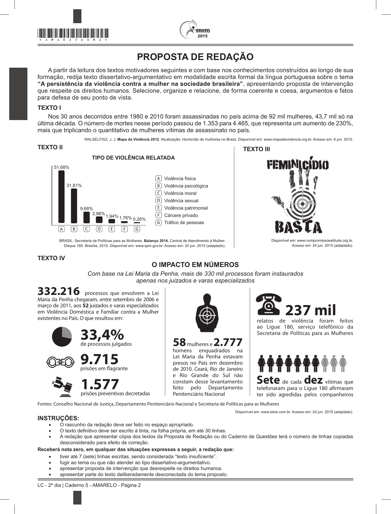

# Redação ENEM 2015 — Dia 2

Gerado automaticamente a partir do PDF oficial.

## Tema

A persistência da violência contra a mulher na sociedade brasileira

## Proposta e textos motivadores

PROPOSTA DE REDAÇÃO
A partir da leitura dos textos motivadores seguintes e com base nos conhecimentos construídos ao longo de sua
formação, redija texto dissertativo-argumentativo em modalidade escrita formal da língua portuguesa sobre o tema
“A persistência da violência contra a mulher na sociedade brasileira”, apresentando proposta de intervenção
que respeite os direitos humanos. Selecione, organize e relacione, de forma coerente e coesa, argumentos e fatos
para defesa de seu ponto de vista.
Texto I
Nos 30 anos decorridos entre 1980 e 2010 foram assassinadas no país acima de 92 mil mulheres, 43,7 mil só na
última década. O número de mortes nesse período passou de 1.353 para 4.465, que representa um aumento de 230%,
mais que triplicando o quantitativo de mulheres vítimas de assassinato no país.
WALSELFISZ, J. J. Mapa da Violência 2012. Atualização: Homicídio de mulheres no Brasil. Disponível em: www.mapadaviolencia.org.br. Acesso em: 8 jun. 2015.
Texto II Texto III
TIPO DE VIOLÊNCIA RELATADA
51,68%
Violência física
31,81% Violência psicológica
Violência moral
Violência sexual
9,68% Violência patrimonial
2,86% Cárcere privado
1,94% 1,76%
0,26%
Tráfico de pessoas
BRASIL. Secretaria de Políticas para as Mulheres. Balanço 2014. Central de Atendimento à Mulher: Disponível em: www.compromissoeatitude.org.br.
Disque 180. Brasília, 2015. Disponível em: www.spm.gov.br. Acesso em: 24 jun. 2015 (adaptado). Acesso em: 24 jun. 2015 (adaptado).
Texto IV
O impacto em números
Com base na Lei Maria da Penha, mais de 330 mil processos foram instaurados
apenas nos juizados e varas especializados
332.216 processos que envolvem a Lei
Maria da Penha chegaram, entre setembro de 2006 e
março de 2011, aos 52 juizados e varas especializados
em Violência Doméstica e Familiar contra a Mulher
existentes no País. O que resultou em:
237 mil
relatos de violência foram feitos
ao Ligue 180, serviço telefônico da
33,4%
de processos julgados 58 mulheres e 2.777
Secretaria de Políticas para as Mulheres
homens enquadrados na
9.715
prisões em flagrante
Lei Maria da Penha estavam
presos no País em dezembro
de 2010. Ceará, Rio de Janeiro
e Rio Grande do Sul não
1.577 constam desse levantamento
feito pelo Departamento
Sete de cada dez vítimas que
telefonaram para o Ligue 180 afirmaram
prisões preventivas decretadas Penitenciário Nacional ter sido agredidas pelos companheiros
Fontes: Conselho Nacional de Justiça, Departamento Penitenciário Nacional e Secretaria de Políticas para as Mulheres
Disponível em: www.istoe.com.br. Acesso em: 24 jun. 2015 (adaptado).
INSTRUÇÕES:
• O rascunho da redação deve ser feito no espaço apropriado.
• O texto definitivo deve ser escrito à tinta, na folha própria, em até 30 linhas.
• A redação que apresentar cópia dos textos da Proposta de Redação ou do Caderno de Questões terá o número de linhas copiadas
desconsiderado para efeito de correção.
Receberá nota zero, em qualquer das situações expressas a seguir, a redação que:
• tiver até 7 (sete) linhas escritas, sendo considerada “texto insuficiente”.
• fugir ao tema ou que não atender ao tipo dissertativo-argumentativo.
• apresentar proposta de intervenção que desrespeite os direitos humanos.
• apresentar parte do texto deliberadamente desconectada do tema proposto.
LC - 2º dia | Caderno 5 - AMARELO - Página 2
2015 *AMAR25DOM3*
LINGUAGENS, CÓDIGOS E SUAS

## Página(s) da Proposta (imagem)

