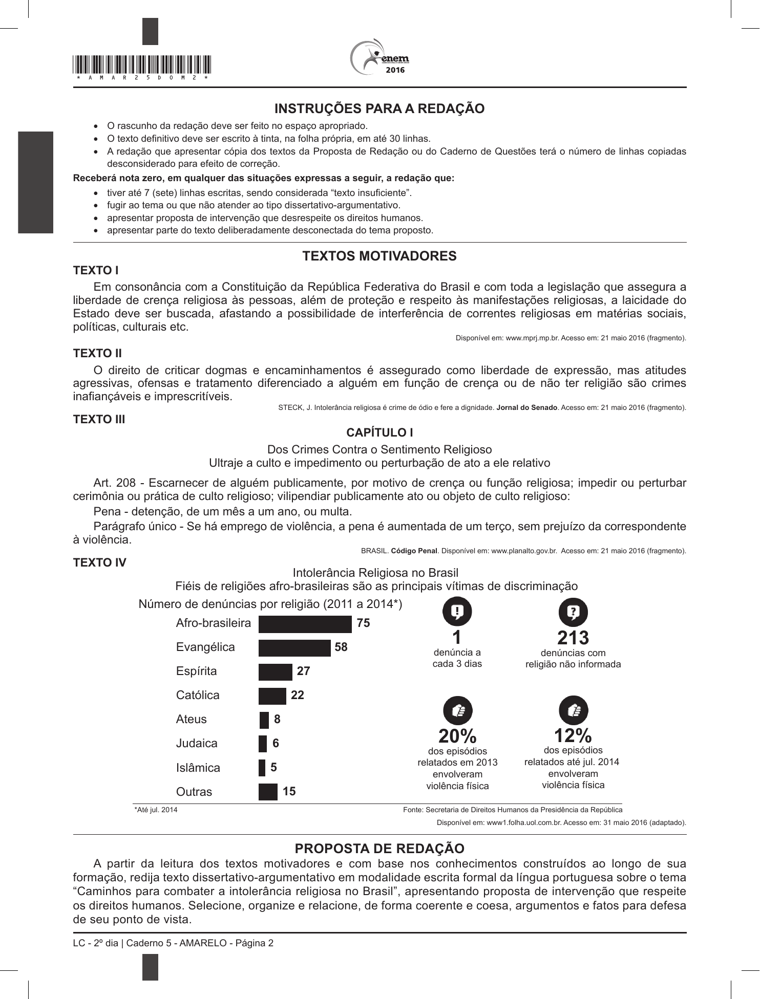

# Redação ENEM 2016 — Dia 2

Gerado automaticamente a partir do PDF oficial.

## Tema

Caminhos para combater a intolerância religiosa no Brasil

## Proposta e textos motivadores

Proposta de Redação
A partir da leitura dos textos motivadores e com base nos conhecimentos construídos ao longo de sua
formação, redija texto dissertativo-argumentativo em modalidade escrita formal da língua portuguesa sobre o tema
“Caminhos para combater a intolerância religiosa no Brasil”, apresentando proposta de intervenção que respeite
os direitos humanos. Selecione, organize e relacione, de forma coerente e coesa, argumentos e fatos para defesa
de seu ponto de vista.
LC - 2º dia | Caderno 5 - AMARELO - Página 2
LINGUAGENS, CÓDIGOS E SUAS

## Página(s) da Proposta (imagem)

