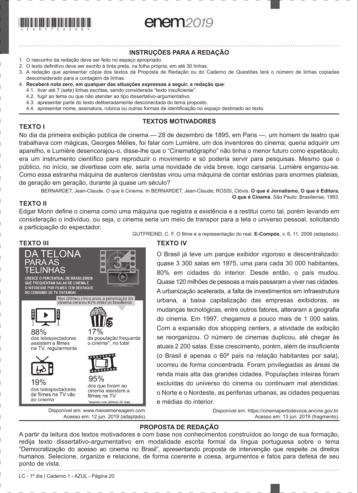

# Redação ENEM 2019 — Dia 1

Gerado automaticamente a partir do PDF oficial.

## Tema

Democratização do acesso ao cinema no Brasil

## Proposta e textos motivadores

PROPOSTA DE REDAÇÃO
A partir da leitura dos textos motivadores e com base nos conhecimentos construídos ao longo de sua formação,
redija texto dissertativo-argumentativo em modalidade escrita formal da língua portuguesa sobre o tema
“Democratização do acesso ao cinema no Brasil”, apresentando proposta de intervenção que respeite os direitos
humanos. Selecione, organize e relacione, de forma coerente e coesa, argumentos e fatos para defesa de seu
ponto de vista.

## Página(s) da Proposta (imagem)

