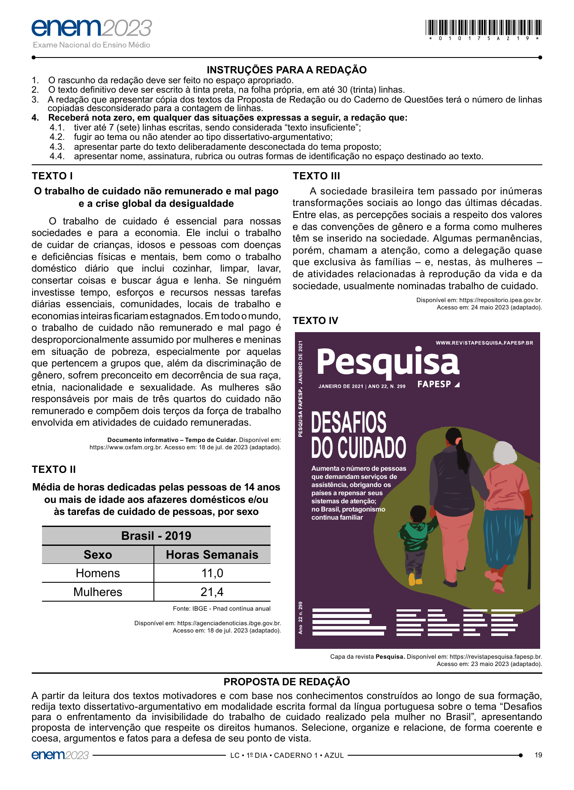

# Redação ENEM 2023 — Dia 1

Gerado automaticamente a partir do PDF oficial.

## Tema

Desafios para o enfrentamento da invisibilidade do trabalho de cuidado realizado pela mulher no Brasil

## Proposta e textos motivadores

PROPOSTA DE REDAÇÃO
A partir da leitura dos textos motivadores e com base nos conhecimentos construídos ao longo de sua formação,
redija texto dissertativo-argumentativo em modalidade escrita formal da língua portuguesa sobre o tema “Desafios
para o enfrentamento da invisibilidade do trabalho de cuidado realizado pela mulher no Brasil”, apresentando
proposta de intervenção que respeite os direitos humanos. Selecione, organize e relacione, de forma coerente e
coesa, argumentos e fatos para a defesa de seu ponto de vista.
–LC • 1º DIA • CADERNO 1 • AZUL– 19

## Página(s) da Proposta (imagem)

