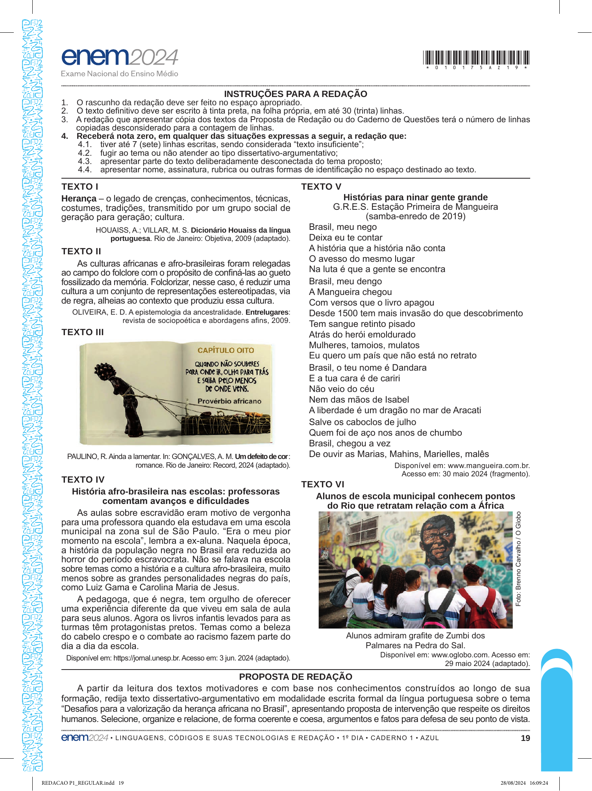

# Redação ENEM 2024 — Dia 1

Gerado automaticamente a partir do PDF oficial.

## Tema

Desafios para a valorização da herança africana no Brasil

## Proposta e textos motivadores

PROPOSTA DE REDAÇÃO
A partir da leitura dos textos motivadores e com base nos conhecimentos construídos ao longo de sua
formação, redija texto dissertativo-argumentativo em modalidade escrita formal da língua portuguesa sobre o tema
“Desafios para a valorização da herança africana no Brasil”, apresentando proposta de intervenção que respeite os direitos
humanos. Selecione, organize e relacione, de forma coerente e coesa, argumentos e fatos para defesa de seu ponto de vista.
• LINGUAGENS, CÓDIGOS E SUAS TECNOLOGIAS E REDAÇÃO • 1 º DIA • CADERNO 1 • AZUL
REDACAO P1_REGULAR.indd 19
TEXTO V
Histórias para ninar gente grande
G.R.E.S. Estação Primeira de Mangueira
(samba-enredo de 2019)
Brasil, meu nego
Deixa eu te contar
A história que a história não conta
O avesso do mesmo lugar
Na luta é que a gente se encontra
Brasil, meu dengo
A Mangueira chegou
Com versos que o livro apagou
Desde 1500 tem mais invasão do que descobrimento
Tem sangue retinto pisado
Atrás do herói emoldurado
Mulheres, tamoios, mulatos
Eu quero um país que não está no retrato
Brasil, o teu nome é Dandara
E a tua cara é de cariri
Não veio do céu
Nem das mãos de Isabel
A liberdade é um dragão no mar de Aracati
Salve os caboclos de julho
Quem foi de aço nos anos de chumbo
Brasil, chegou a vez
De ouvir as Marias, Mahins, Marielles, malês
Disponível em: www.mangueira.com.br.
Acesso em: 30 maio 2024 (fragmento).
TEXTO VI
Alunos de escola municipal conhecem pontos
do Rio que retratam relação com a África
Foto: Brenno Carvalho / O Globo
Alunos admiram grafite de Zumbi dos
Palmares na Pedra do Sal.
Disponível em: www.oglobo.com. Acesso em:
29 maio 2024 (adaptado).

## Página(s) da Proposta (imagem)

