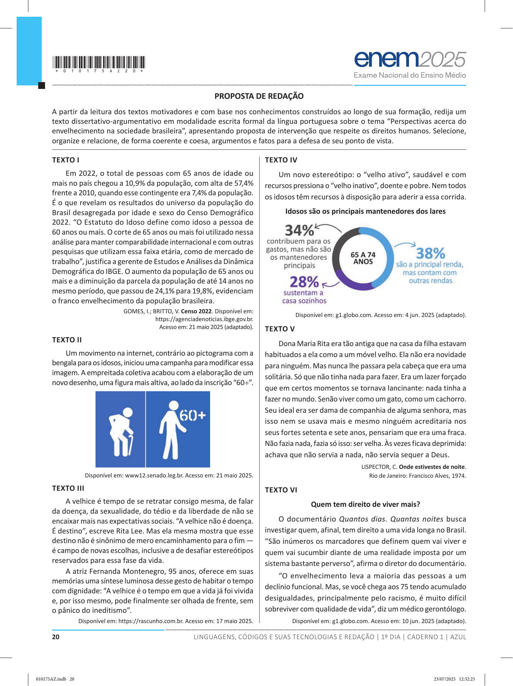

# Redação ENEM 2025 — Dia 1

Gerado automaticamente a partir do PDF oficial.

## Tema

Perspectivas acerca do envelhecimento na sociedade brasileira

## Proposta e textos motivadores

PROPOSTA DE REDAÇÃO
A partir da leitura dos textos motivadores e com base nos conhecimentos construídos ao longo de sua formação, redija um
texto dissertativo-argumentativo em modalidade escrita formal da língua portuguesa sobre o tema “Perspectivas acerca do
envelhecimento na sociedade brasileira”, apresentando proposta de intervenção que respeite os direitos humanos. Selecione,
organize e relacione, de forma coerente e coesa, argumentos e fatos para a defesa de seu ponto de vista.
TEXTO I
Em 2022, o total de pessoas com 65 anos de idade ou
mais no país chegou a 10,9% da população, com alta de 57,4%
frente a 2010, quando esse contingente era 7,4% da população.
É o que revelam os resultados do universo da população do
Brasil desagregada por idade e sexo do Censo Demográfico
2022. “O Estatuto do Idoso define como idoso a pessoa de
60 anos ou mais. O corte de 65 anos ou mais foi utilizado nessa
análise para manter comparabilidade internacional e com outras
pesquisas que utilizam essa faixa etária, como de mercado de
trabalho”, justifica a gerente de Estudos e Análises da Dinâmica
Demográfica do IBGE. O aumento da população de 65 anos ou
mais e a diminuição da parcela da população de até 14 anos no
mesmo período, que passou de 24,1% para 19,8%, evidenciam
o franco envelhecimento da população brasileira.
GOMES, I.; BRITTO, V. Censo 2022. Disponível em:
https://agenciadenoticias.ibge.gov.br.
Acesso em: 21 maio 2025 (adaptado).
TEXTO II
Um movimento na internet, contrário ao pictograma com a
bengala para os idosos, iniciou uma campanha para modificar essa
imagem. A empreitada coletiva acabou com a elaboração de um
novo desenho, uma figura mais altiva, ao lado da inscrição “60+”.
Disponível em: www12.senado.leg.br. Acesso em: 21 maio 2025.
TEXTO III
A velhice é tempo de se retratar consigo mesma, de falar
da doença, da sexualidade, do tédio e da liberdade de não se
encaixar mais nas expectativas sociais. “A velhice não é doença.
É destino”, escreve Rita Lee. Mas ela mesma mostra que esse
destino não é sinônimo de mero encaminhamento para o fim —
é campo de novas escolhas, inclusive a de desafiar estereótipos
reservados para essa fase da vida.
A atriz Fernanda Montenegro, 95 anos, oferece em suas
memórias uma síntese luminosa desse gesto de habitar o tempo
com dignidade: “A velhice é o tempo em que a vida já foi vivida
e, por isso mesmo, pode finalmente ser olhada de frente, sem
o pânico do ineditismo”.
Disponível em: https://rascunho.com.br. Acesso em: 17 maio 2025.
TEXTO IV
Um novo estereótipo: o “velho ativo”, saudável e com
recursos pressiona o “velho inativo”, doente e pobre. Nem todos
os idosos têm recursos à disposição para aderir a essa corrida.
Idosos são os principais mantenedores dos lares
Disponível em: g1.globo.com. Acesso em: 4 jun. 2025 (adaptado).
TEXTO V
Dona Maria Rita era tão antiga que na casa da filha estavam
habituados a ela como a um móvel velho. Ela não era novidade
para ninguém. Mas nunca lhe passara pela cabeça que era uma
solitária. Só que não tinha nada para fazer. Era um lazer forçado
que em certos momentos se tornava lancinante: nada tinha a
fazer no mundo. Senão viver como um gato, como um cachorro.
Seu ideal era ser dama de companhia de alguma senhora, mas
isso nem se usava mais e mesmo ninguém acreditaria nos
seus fortes setenta e sete anos, pensariam que era uma fraca.
Não fazia nada, fazia só isso: ser velha. Às vezes ficava deprimida:
achava que não servia a nada, não servia sequer a Deus.
LISPECTOR, C. Onde estivestes de noite.
Rio de Janeiro: Francisco Alves, 1974.
TEXTO VI
Quem tem direito de viver mais?
O documentário Quantos dias. Quantas noites busca
investigar quem, afinal, tem direito a uma vida longa no Brasil.
“São inúmeros os marcadores que definem quem vai viver e
quem vai sucumbir diante de uma realidade imposta por um
sistema bastante perverso”, afirma o diretor do documentário.
“O envelhecimento leva a maioria das pessoas a um
declínio funcional. Mas, se você chega aos 75 tendo acumulado
desigualdades, principalmente pelo racismo, é muito difícil
sobreviver com qualidade de vida”, diz um médico gerontólogo.
Disponível em: g1.globo.com. Acesso em: 10 jun. 2025 (adaptado).
L
INSTRUÇÕES PARA A REDAÇÃO
1. O rascunho da redação deve ser feito no espaço apropriado.
2. O texto definitivo deve ser escrito à tinta preta, na folha própria, em até 30 (trinta) linhas.
3. A redação que apresentar cópia dos textos da Proposta de Redação ou do Caderno de Questões terá o número de linhas
copiadas desconsiderado para a contagem de linhas.
4. Receberá nota zero, em qualquer das situações expressas a seguir, a redação que:
4.1. tiver até 7 (sete) linhas escritas, sendo considerada “texto insuficiente”;
4.2. fugir ao tema ou não atender ao tipo dissertativo-argumentativo;
4.3. apresentar parte do texto deliberadamente desconectada do tema proposto;
4.4. apresentar nome, assinatura, rubrica ou outras formas de identificação no espaço destinado ao texto.

## Página(s) da Proposta (imagem)

