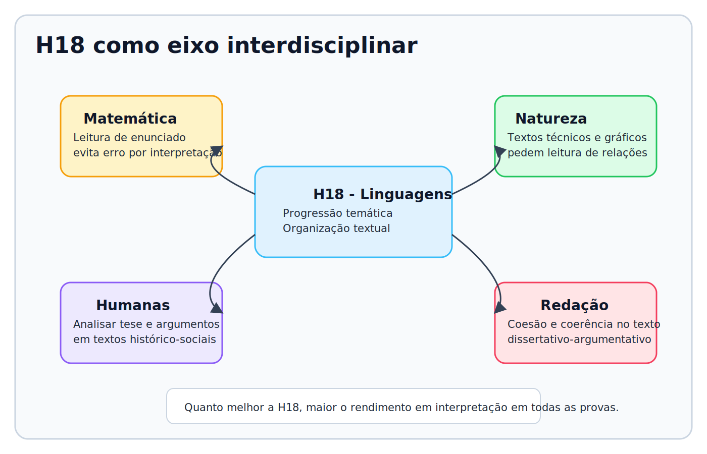
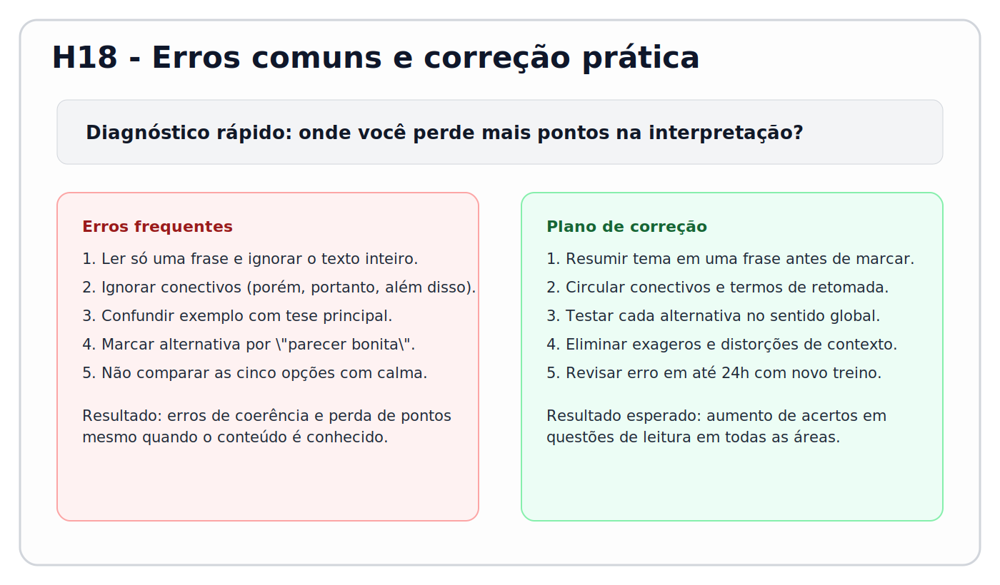

# Aula ENEM — Habilidade H18 (Linguagens)

**Fonte-base:** Matriz de Referência ENEM (INEP)  
**Habilidade foco:** H18 — Identificar os elementos que concorrem para a progressão temática e para a organização e estruturação de textos de diferentes gêneros e tipos.  
**Tempo estimado:** 60 a 90 minutos  
**Pré-requisitos:** leitura básica de textos argumentativos e noção de conectivos

---

## 1. Objetivo da aula
Ao final, você será capaz de:
- [ ] identificar tema, recorte e tese principal de um texto;
- [ ] analisar como as ideias avançam de um parágrafo para outro;
- [ ] eliminar alternativas incoerentes em questões de interpretação.

---

## 2. Contexto ENEM (intercontextualização)
**Cenário real:** em notícias, campanhas públicas e textos de opinião, ideias são organizadas para convencer o leitor. No ENEM, a banca cobra exatamente essa leitura estrutural: entender não só “o que foi dito”, mas “como foi organizado”.

**Por que isso cai no ENEM:**
- aparece em Linguagens, Humanas, Natureza e até em enunciados de Matemática;
- diferencia leitura superficial de leitura estratégica;
- reduz erro por interpretação apressada.

---

## 3. Teoria essencial (sem enrolar)
### 3.1 Conceitos-chave
- **Progressão temática:** modo como o tema avança ao longo do texto.
- **Organização textual:** forma como o texto distribui introdução, desenvolvimento e fechamento.
- **Coesão:** elementos linguísticos que conectam partes do texto (conectivos, pronomes, retomadas).
- **Coerência:** unidade de sentido global.

### 3.2 Como o ENEM “disfarça” isso
- pergunta sobre “efeito de sentido” de um trecho, mas na prática cobra função do parágrafo;
- traz alternativas com palavras do texto, porém com relação lógica alterada;
- usa conectivos como pista principal para identificar contraste, causa, conclusão ou adição.

---

## 4. Método de resolução (passo a passo)
> Use este procedimento em qualquer questão da H18.

1. **Identifique o comando da questão:** inferir, relacionar, justificar, interpretar.
2. **Localize o tema central:** resuma o texto em uma frase curta.
3. **Marque conectivos e retomadas:** “porém”, “portanto”, “além disso”, “esse fenômeno”.
4. **Teste cada alternativa no sentido global:** não aceite opção baseada em frase isolada.
5. **Cheque armadilhas:** exageros, conclusões absolutas e mudança indevida de foco.

---

## 5. Interdisciplinaridade (2 conexões mínimas)
### Conexão 1 — Matemática
- **Relação:** melhora leitura de enunciados longos e identificação do que realmente deve ser calculado.
- **Como pode cair:** problema com dados em excesso em que o erro vem da interpretação, não da conta.

### Conexão 2 — Ciências Humanas
- **Relação:** análise de tese, argumento e contra-argumento em textos históricos e sociológicos.
- **Como pode cair:** questão pede posição do autor a partir da estrutura argumentativa.

### Conexão 3 — Redação
- **Relação:** coesão e coerência são base para um texto dissertativo forte.
- **Como pode cair:** sua leitura da H18 melhora repertório e organização da própria escrita.

---

## 6. Exemplos resolvidos
### Exemplo 1 (básico)
**Enunciado:** “A mobilidade urbana avançou em algumas capitais. Porém, regiões periféricas ainda enfrentam baixa cobertura.”  
**Resolução:**
1. Tema: mobilidade urbana.
2. Conectivo “porém” indica contraste.
3. O texto reconhece avanço, mas ressalta limite.
**Resposta:** leitura correta é “avanço parcial com desigualdade de acesso”.

### Exemplo 2 (ENEM-like)
**Enunciado:** “A escola incorporou recursos digitais. Entretanto, sem formação docente contínua, os resultados permaneceram modestos.”  
**Resolução:**
1. Identificar comando (efeito de sentido).
2. “Entretanto” opõe expectativa e resultado.
3. Tese implícita: tecnologia isolada não garante melhoria.
**Resposta:** foco está na condição de implementação, não na rejeição da tecnologia.

---

## 7. Treino progressivo
### 7.1 Questões conceituais (5)
1. Defina progressão temática em uma frase.
2. Diferencie coesão referencial e coesão sequencial.
3. Explique o papel de conectivos adversativos.
4. Diga quando há incoerência global em um texto.
5. Identifique a função de um parágrafo de conclusão.

### 7.2 Questões aplicadas (5)
1. Marque o tema e recorte de um texto curto de opinião.
2. Identifique duas retomadas e seu referente.
3. Explique a função de “portanto” em um parágrafo final.
4. Reescreva um trecho para melhorar coesão.
5. Classifique a relação lógica de três conectivos.

### 7.3 Questões estilo ENEM (10)
Distribuição: 5 fáceis, 3 médias e 2 difíceis.

**Q1 [Fácil].** Em “A campanha elevou a adesão inicial. Ainda assim, houve queda no mês seguinte”, o conectivo indica: 
A) adição 
B) contraste 
C) causa 
D) explicação 
E) conclusão

**Q2 [Fácil].** A expressão “esse processo” em um parágrafo costuma: 
A) iniciar tema novo 
B) retomar ideia anterior 
C) concluir texto sempre 
D) eliminar ambiguidade por definição 
E) anular argumento

**Q3 [Fácil].** Uma alternativa incorreta em H18 geralmente: 
A) preserva o sentido global 
B) melhora a progressão 
C) repete dados com mesma relação lógica 
D) distorce a relação entre ideias 
E) identifica função do trecho

**Q4 [Fácil].** Em leitura crítica, “portanto” é pista de: 
A) oposição 
B) conclusão 
C) dúvida 
D) comparação 
E) enumeração

**Q5 [Fácil].** Quando a banca pede “posição do autor”, o foco principal é: 
A) palavra mais técnica 
B) opinião do leitor 
C) encadeamento argumentativo 
D) data de publicação 
E) tamanho do texto

**Q6 [Média].** Em “Embora o acesso à internet tenha ampliado repertórios, a desigualdade digital ainda limita oportunidades”, a relação principal entre as orações é de: 
A) adição simples 
B) conclusão 
C) concessão com contraste 
D) finalidade 
E) exemplificação

**Q7 [Média].** Em um texto em que o 1º parágrafo apresenta o problema, o 2º traz dados e o 3º propõe solução, a função principal do 2º parágrafo é: 
A) mudar de assunto para tema secundário 
B) repetir a introdução sem nova função 
C) sustentar o problema com evidências 
D) encerrar a discussão com opinião pessoal 
E) desfazer a tese do autor

**Q8 [Média].** Se um texto organiza as ideias como “definição do tema -> causas -> impactos -> proposta”, a progressão temática é melhor descrita como: 
A) enumeração aleatória 
B) contraste sem tese 
C) descrição neutra sem conclusão 
D) encadeamento explicativo até intervenção 
E) narrativa pessoal cronológica

**Q9 [Difícil].** No trecho “O autor reconhece ganhos da automação, mas alerta para regulação trabalhista”, qual alternativa preserva a coerência global? 
A) A automação é totalmente prejudicial e deve ser proibida. 
B) A regulação é desnecessária porque os ganhos econômicos bastam. 
C) O texto rejeita qualquer avanço tecnológico por princípio. 
D) O autor apenas lista fatos, sem posicionamento. 
E) O texto articula benefícios e riscos, defendendo equilíbrio regulatório.

**Q10 [Difícil].** Se o conectivo “portanto” for trocado por “no entanto” em um parágrafo conclusivo, o efeito mais provável será: 
A) manter a mesma relação lógica de conclusão 
B) intensificar a exemplificação anterior 
C) transformar a relação em sequência temporal 
D) quebrar a coerência, trocando conclusão por oposição 
E) eliminar toda a progressão temática do texto

---

## 8. Gabarito comentado (com análise das erradas)
- **Q1: B**  
✅ “Ainda assim” marca contraste.  
❌ A, C, D e E ignoram o valor adversativo.

- **Q2: B**  
✅ “Esse processo” retoma conteúdo prévio.  
❌ A/C/D/E atribuem função que não é de retomada.

- **Q3: D**  
✅ Distratores costumam alterar a relação lógica do texto.  
❌ A/B/C/E descrevem condutas de leitura correta.

- **Q4: B**  
✅ “Portanto” introduz conclusão.  
❌ A/C/D/E não correspondem ao conectivo.

- **Q5: C**  
✅ A posição do autor aparece no percurso argumentativo.  
❌ A/B/D/E não são critério central de interpretação.

- **Q6: C**  
✅ “Embora” indica concessão, com contraste entre avanço e limite.  
❌ A/B/D/E não representam a relação concessiva do trecho.

- **Q7: C**  
✅ O parágrafo de dados funciona como evidência para sustentar a tese/problema.  
❌ A/B/D/E descrevem funções que quebram a progressão argumentativa proposta.

- **Q8: D**  
✅ Há encadeamento lógico do conceito até a intervenção.  
❌ A/B/C/E não refletem a organização temática apresentada.

- **Q9: E**  
✅ Preserva a tese de equilíbrio entre benefício tecnológico e regulação.  
❌ A/B/C/D distorcem o posicionamento do autor.

- **Q10: D**  
✅ A troca altera a relação lógica e pode quebrar a coerência do fechamento.  
❌ A/B/C/E não explicam corretamente o efeito principal da substituição.

---

## 9. Erros comuns e como corrigir
- **Erro:** ler só uma frase e marcar resposta.  
  **Correção:** resumir o texto em 1 frase antes de analisar alternativas.
- **Erro:** ignorar conectivos.  
  **Correção:** circular conectivos na primeira leitura.
- **Erro:** confundir exemplo com tese.  
  **Correção:** perguntar “qual ideia o exemplo está sustentando?”.
- **Erro:** escolher alternativa “bonita”.  
  **Correção:** testar cada opção contra o sentido global.

---

## 10. Mini-plano de revisão (7 dias)
- **D+1:** 10 questões fáceis de interpretação.
- **D+3:** 10 questões mistas com textos de áreas diferentes.
- **D+5:** revisão dos erros mais frequentes.
- **D+7:** mini-simulado (15 questões) + correção comentada.

---

## 11. Tracker (cole no seu controle)
- H18 — acertos: __/10 ENEM-like
- Principais erros: conectivos / função de parágrafo / tese x exemplo
- Próximo foco: H22 (relação entre opiniões e recursos linguísticos)

---

## 12. Competências e habilidades associadas (INEP)
- **Eixos cognitivos:** Dominar linguagens, Compreender fenômenos, Construir argumentação.
- **Competência da área:** Competência 6 (sistemas simbólicos das linguagens).
- **Habilidade foco:** H18.
- **Habilidades relacionadas:** H19, H22, H23, H24.
